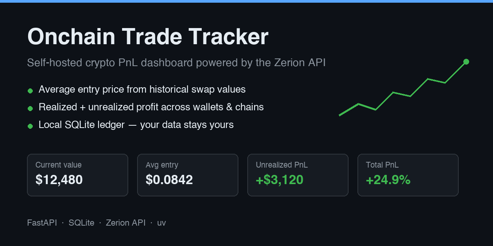

# Onchain Trade Tracker



A self-hosted **crypto portfolio tracker** and **DeFi PnL dashboard** for onchain
trades across multiple wallets, powered by the [Zerion API](https://developers.zerion.io).
It syncs your DEX swap transactions into a local SQLite ledger, computes **cost
basis** and **average entry price** (using the USD value of what you sold at swap
time), and shows current value plus **realized and unrealized profit and loss** —
cross-checked against Zerion's own PnL numbers.

Works on any chain Zerion indexes — Ethereum, Base, Arbitrum, Optimism, Polygon,
Solana, Robinhood Chain, and 30+ more — with no account, no subscription, and no
data leaving your machine. A free, open-source alternative to paid trade-PnL
features in portfolio apps.

## Setup

1. Get an API key at [dashboard.zerion.io](https://dashboard.zerion.io).
2. Edit `.env`:

   ```
   ZERION_API_KEY=zk_prod_...
   WALLET_ADDRESSES=0xabc...,0xdef...
   ```

3. Install dependencies:

   ```
   uv sync
   ```

## Run

```
uv run uvicorn tracker.app:app --port 8000
```

Open http://localhost:8000 and hit **Sync**. Trades land in `tracker.db`
(gitignored); syncs are incremental after the first pull.

## How PnL is computed

- Every Zerion `trade` transaction is stored as one swap (sold → bought).
- **Cost basis** of a buy = USD value of the asset you sold at swap time + network fee.
- **Average entry price** = total USD spent ÷ total units bought.
- **Realized PnL** uses the average-cost method when you sell.
- **Unrealized PnL** = current value (live from Zerion positions) − remaining cost basis.
- Tokens sold without a tracked purchase (e.g. ETH you bridged in) are flagged
  with `*` — those units carry no cost basis and contribute zero realized PnL.
- The **Zerion check** badge compares our total PnL per token against Zerion's
  `/pnl` endpoint; `✓` means within 1%.
